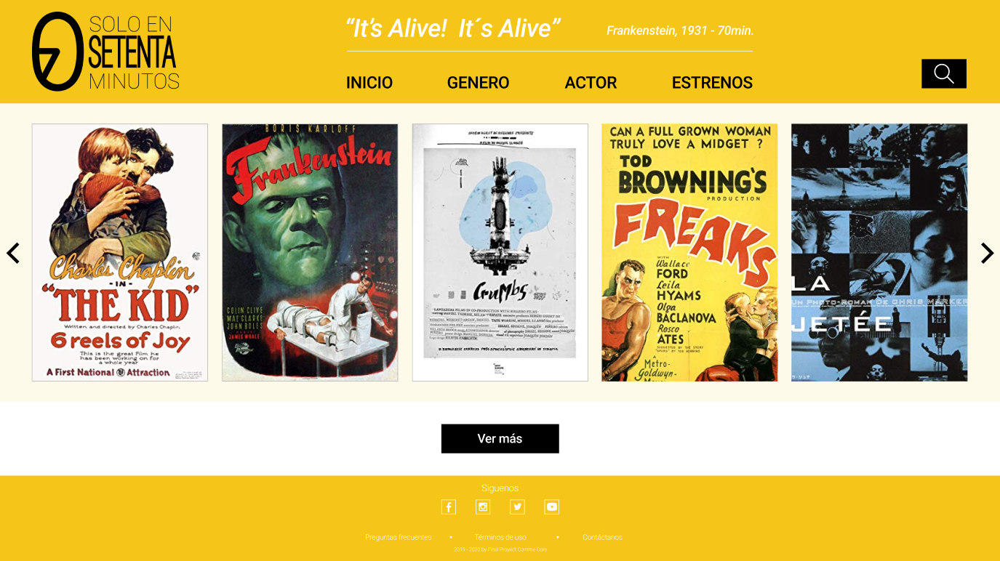
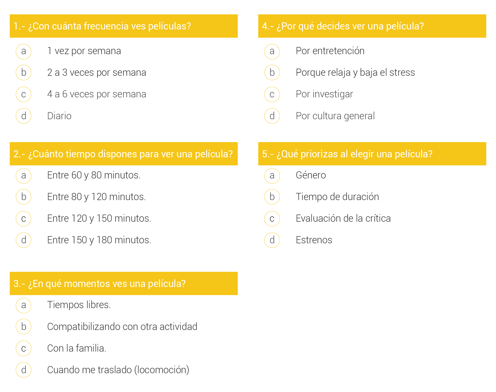
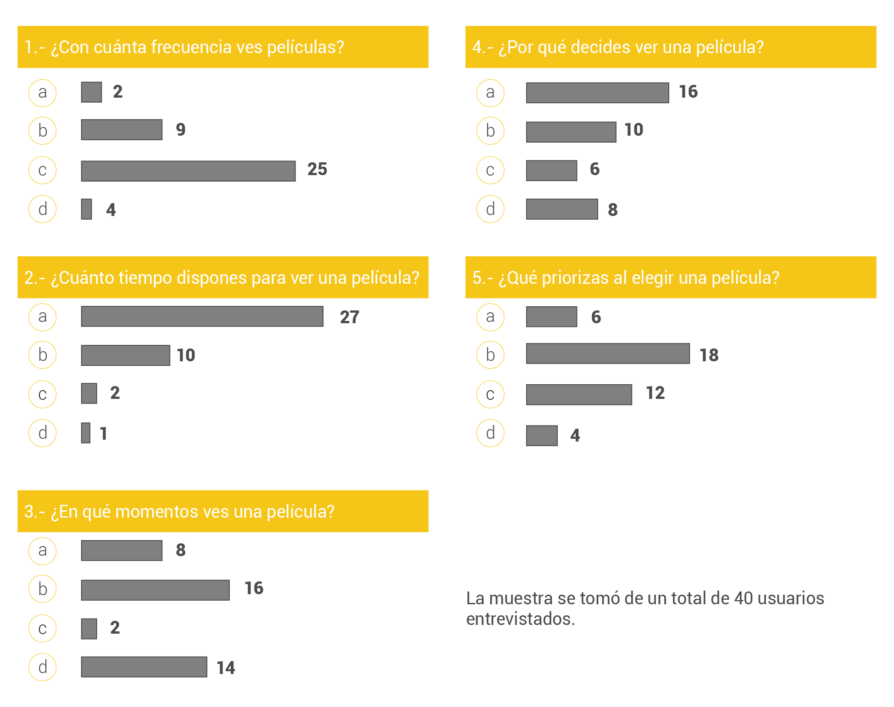
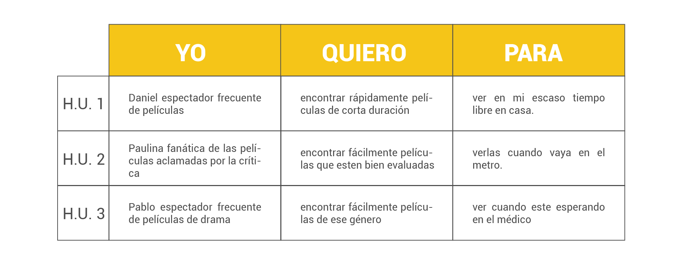
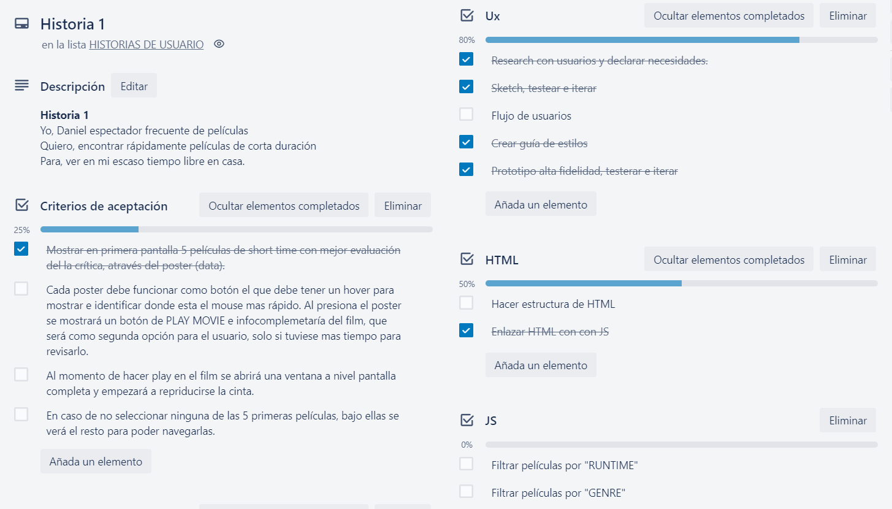
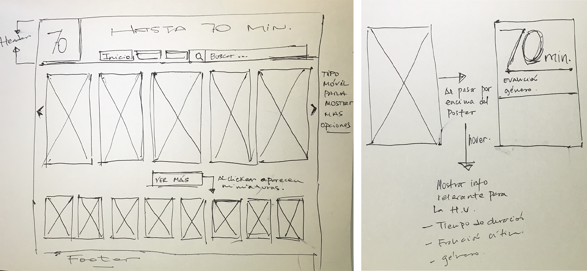
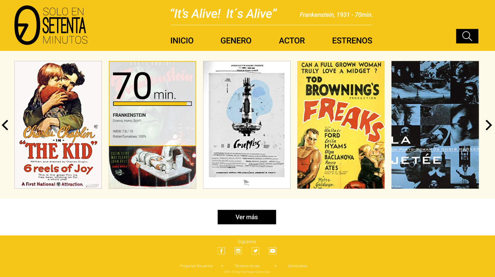
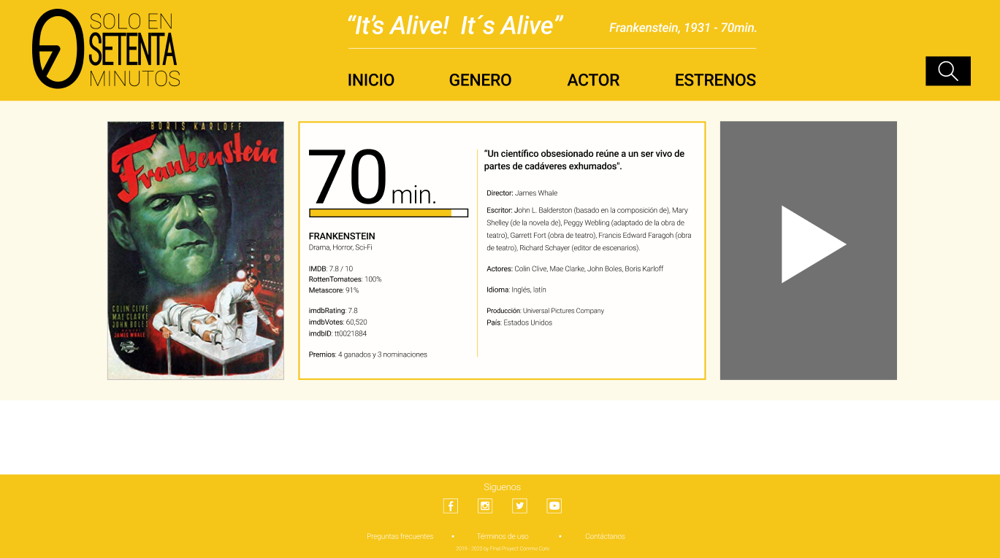

# Solo en 70 minutos

**Solo en 70 minutos** es una plataforma digital donde los espectadores frecuentes de películas que disponen de poco tiempo para hacerlo, podrán encontrar cine de corta duración y con buena evaluación de la crítica para ver.

Para ver [clickea aquí](https://natigrottes.github.io/final-commoncore/final-commoncore/src/index.html)

## Desarrollado para

[Laboratoria](https://www.laboratoria.la/)

## Tecnología y lenguaje utilizado

- JavaScript (ES6)
- Boostrap 4
- HTML dinámico y semántico
- Css3

## Historias de Usuario

### 1. Definiendo al usuario

Para poder conocer y determinar con mayor claridad los usuarios, realizamos un entrevista colaborativa a modo de *focus group* con hombres y mujeres que tenían entre 20 y 50 años y que se caracterizaban por trabajar en jornadas laborales de 45 horas semanales y que ven películas frecuentemente. De esa forma identificamos necesidades, deseos y generamos empatía con los usuarios. Concluyendo lo siguiente:

1. ¿Quiénes son los principales usuarios del producto?

Nuestro proyecto está dirigido a espectadores frecuentes de películas quiénes cuentan con poco tiempo libre al día para dedicarse a ver alguna película como ellos quisieran, sin embargo constantemente están búscando alguna que se adapte a esas necesidades de tiempo que disponen. De igual forma, la búsqueda de algún título para ver también les hace perder tiempo, por lo que terminan desertando. 

2. ¿Cuáles son los objetivos de estos usuarios en relación con el producto?

Los usuarios constantemente buscan películas que se adapten al escaso tiempo libre que tienen, por lo tanto, ellos necesitan que esa información ya este procesada para que puedan conseguir en un tiempo mucho más acotado lo que necesitan.

3. ¿Cuándo utilizan o utilizarían el producto?

Nuestros usuarios al día regularmente tienen entre 60 a 80 min. aprox. para entretención, compatibilazando con otras actividades como por ejemplo: de camino a la casa después del trabajo, en la hora de colacion, en la misma casa comiendo algo luego de llegar del trabajo, etc. En intancias como esas los usuarios sacarían mayor provecho de la plataforma digital de películas, por lo tanto, es necesario que nuestro proyecto sea *responsive* y funcione en desktop y celulares.

4. ¿Cuáles son los datos más relevantes que quieren ver en la interfaz y por qué?

Nuestros usuarios declaran que lo más importante y de primera necesidad, es que el proceso de selección de la película sea rápido y claro. Elegir un título les resta tiempo del poco que ya disponen, por lo que la información que requieren debe estar explícita. 

Todo lo anteriormente descrito está basado en el *focus group* que realizamos, del cual obtuvimos información que consideramos importante para desarrollar como proyecto.

Las preguntas que realizamos fueron las siguientes:

 

Y los resultados se representaron a través del siguiente gráfico:

En los resultados se puede apreciar, la tendencia hacia el poco tiempo libre que disponen y lo mucho que les gusta ver películas. Por este motivo nosotras decidimos enfocar nuestra primera Historia de Usuario en hacer un match entre esas mayorías.

## 2. Definiendo Historias de Usuario

Para definir cada Historia de Usuario (H.U.), utilizamos 3 parámetros:

**Yo** (usuario), **Quiero** (objetivo del usuario), **Para** (propósito de ese objetivo).

Con esta matriz logramos armar 3 Historias de Usuarios basadas en los resultados del *focus group*.

Para las Historias de Usuario antes mencionadas, es necesario establecer los **Criterios de Aceptación** y la **Definición de Terminado**, los que debemos conseguir para completar cada una de ellas satisfactoriamente. De acuerdo a esto realizamos una planificación que explicaremos a continuación.

##Planificación

Organizarnos y declarar los objetivos es sumamente importante para alcanzar el óptimo desarrollo del proyecto, por lo que decidimos trabajar con [Trello](https://trello.com/b/9TSb0WAP/final-common-core-project) donde dejamos expresado las tareas que debemos ir realizando. 

Dentro de esta planificación está el detalle de las actividades a realizar para alcanzar nuestra primera Historia de Usuario, pincha [acá](https://trello.com/c/iQaH3zsv/1-historia-1) para verla directamente desde la página.

# Definición de Terminado

Para poder dar por terminada la primera Historia de Usuario, debemos haber cumplido los siguientes criterios:

-	El código cumple con la guía de estilos acordada.
-	El código se encuentra en el repositorio.
-	El código tiene y pasa los test necesarios.
-	El código ha sido hecho code review.
-	La historia de usuario implementada ha sido probada con al menos 5 usuarios, y se han incorporado las mejoras identificadas en los testeos de usabilidad.

## Diseño de la Interfaz de Usuario

### Prototipo de baja fidelidad

1. Wireframe en Sketch

Para comenzar con el diseño del producto, decidimos hacer los primeros bosquejos en papel, para tomar ciertas directrices y luego formalizarlo digitalmente. 

En primera instancia, habíamos considerado que al clickear el botón **ver más** mostraríamos las carátulas de las películas de un tamaño más pequeño, sin embargo la idea fue cambiando y decidimos dejarlas todas del mismo tamaño, agregando a las que estaban en primera posición un efecto de **carrusel**, de esta manera lograbamos llegar a los mismos resultados dependiendo del comportamiento de navegación del usuario.

Por otro lado,  la barra de búsqueda la habíamos propuesto a la vista en la parte del header, sin embargo como el objetivo es facilitar la interacción con las películas preferimos dejarla oculta y destacar las portadas de las películas dandoles mayor protagonismo dentro de la pantalla.

Con todas estas modificaciones al sketch decidimos pasar a Figma para ya digitalizar y comenzar la etapa de testeo.

### Prototipo de Alta Fidelidad

Con el diseño en Figma logramos visualizar con mayor claridad como luciría y cuáles serían las interaciones del producto final. Aplicamos cuadros de estilo y principios de diseño visual para alcanzar un mejor resultado.

Ver [Prototipo para Desktop en Figma](https://www.figma.com/proto/vLdq8eT6e096S5aNAZetKK/70-min.?node-id=2%3A2&scaling=scale-down-width)

### Fundamentos de Visual Design

Las decisiones de color y formas están direccionadas por referentes propios del cine. Las formas lineales y ángulos rectos son patrones y hallazgos de recursos que se usan en la producción del un film. 
Quisimos plasmar lo que nos comunica visualmente y simbólicamente por ejemplo una **claqueta de cine**, una **cinta de cine antiguo** o la misma estatuilla de los premios **Oscar's**. 

Respecto a los fundamentos de Visual Design, nuestro prototipo cumple con cada uno de los 4 criterios CRAP:

1. **Contraste**: Los colores usados generan la relación de contraste necesaria para hacer que el producto sea legible y agradable a la vista. La tipografía **ROBOTO** es de fácil lectura y se adapta bien a los distintos tamaños. Jerarquizamos los elementos de acuerdo a prioridad, y ademas le dimos estados a los distintos botones para diferenciarlos y hacerlos visibles para el usuario.

2. **Repetición**: Nos preocupamos de mantener un lenguaje para todos los componentes de la página, en formas, colores, iconografía y estructuras generales de una página web, aplicando HTML semántico.

3. **Alineación**: Planteamos una grilla para ubicar los elementos en el canvas, para poder adaptarlos y distribuirlos coherentemente.

4. **Proximidad**: Agrupamos elementos que tienen relación, como por ejemplo el menú de navegación, ubicado en el centro de la página, lejos del logo y del buscador. Por otro lado, las carátulas de las películas tienen cierta distancias entre ellas para que no se vean como un solo elemento, sino que era necesario individualizarlas, sin embargo pertenecen al mismo grupo por eso aún existe cercanía entre ellas.

## Definir la interfaz de usuario

Para que nuestra interfaz tuviese validez y fuera útil para nuestros usuarios debería cumplir con ciertos objetivos:

- Permitir mostrar y navegar un catálogo de películas de corta duración.

- Dar información de cada una de las películas disponibles de manera clara y concisa.

- Implementar un buscador en caso que el usuario necesite algo específico o sepa lo que quiere ver.

- Estar linkeado a una base de datos o plataforma de reproducción de películas, para que el usuario pueda acceder rapidamente a su selección y desde la misma

- Mostrar visualmente un diseño entretenido, con cáracter de cine y que fuese de fácil navegación.

- Destacar los elementos que el usuario va mirando, a través de una respuesta visual (ej: estados de un botón).

- Estar disponible en versión desktop y móvil.

## Testeos de Usabilidad

Por temas de tiempo no alcanzamos a testear con el prototipo resultado del código, sin embargo nuestro producto diseñado en Figma cumplía fielmente a las interacciones que queríamos evaluar. 

Establecimos una pauta previa para abordar a los usuarios que nos ayudarían con sus comentarios sobre el proyecto.

Links de testeos:

1.- [Testo 1](https://www.loom.com/share/44a08d9dde2443eeb4b9a7227b24f732) 

2.-[Testeo 2](https://www.loom.com/share/4351ff7220e646abb9ef2f999f9b2a45)

3.- [Testeo 3](https://www.loom.com/share/02ee6a2df3d14aa6be9a96cb6f0537c6)

4.- [Testeo 4](https://www.loom.com/share/491d17131be54391888f185db6d2eef3)

5.- [Testeo 5](https://www.loom.com/share/71b1dbb34b754c28b7768e46992cea3d)

Luego de realizar los 5 testeos a los usuarios que son espectadores frecuentes de películas, obtuvimos las siguientes conclusiones:

**Aspectos positivos**

- Visualmente atractiva.
- Muestra información clara.
- Importante que tenga la evalución de la crítica y de los espectadores.
- De fácil acceso e intuitiva.
- Se agradece que muestre el tiempo de una película, porque de esa forma pueden planificarse.
- Ofrece un lenguaje visual familiar.
- Se diferencia del restos de plataformas de películas que conocen.

**Aspectos a mejorar**

- Destacar mas aún el estado del botón de la película para seleccionar, no se les hizo fácil llegar a la segunda página.
- Considerar segunda página como una ventana modal.
- Destacar más el rating de evaluación de los críticos, tal vez gamificando.
- Evaluar el logo, que sea menos conceptual.
- Evaluar el botón de play de la segunda página.

## Conclusiones finales

- Consideramos que el proyecto fue todo un desafío sobre todo en términos de tiempo. 
Y tal vez no logramos con todo y de la forma que nos hubiera gustado, sin embargo trabajamos colaborativamente y eso hizo que el proyecto avanzara.

- Nos faltó testear el producto final por lo que claramente no logramos iterar lo suficiente para lograr un mejor produto.

## Proyecto realizado por:

- Rena Rivero
- Camila Rojas 
- Camila Osores 
- Nataly Cuevas

